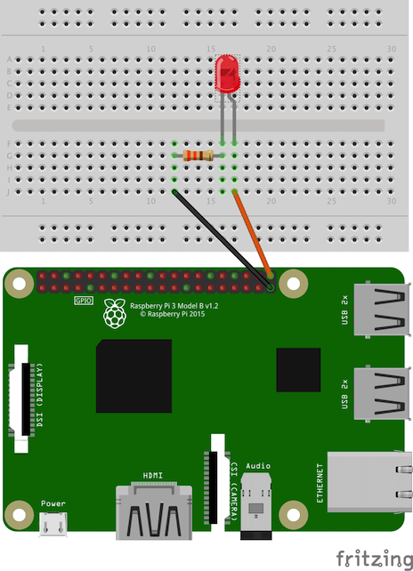

__Connect eny with your own products / services__  

https://www.quantum.ne.jp/eny/  
[GET STARTED WITH ENY DEVELOPER KIT](https://www.quantum.ne.jp/eny/developer-kit/)

---

__Tested on__  
- Mac / Raspberry PI  
- python 2.7 / 3.5

## Setup

1. Install FTDI driver from http://www.ftdichip.com/Drivers/D2XX.htm
1. Install requirements.txt
	- ```pip install -r requirements.txt```
	- OR you can install as "eny" command line > ```python setup.py install```
1. Check eny serial number  
	
1. Connect eny USB host with PC
1. Register eny device
	- ```./eny.py pair add F1234567 # THE SERIAL NUMBER```
1. Click the eny button!
	- ```./eny.py listen```

## Usage eny.py

```bash
# Show help
./eny.py -h
./eny.py pair -h

# Listen mode, ctl-c to exit
./eny.py listen

# View all pairing devices
./eny.py pair view

# Add new device
./eny.py pair add FFF00001

# Delete the device from pairing
./eny.py pair del 01

# Reset all pairing devices
./eny.py pair reset

# Get the host reciever ID
./eny.py get_id

# (Optional)
# Port name like /dev/ttyUSB*
./eny.py --port /dev/ttyUSB*
# Serial baudrate
./eny.py --baudrate 115200
```


## Sample IFTTT

1. Connect IFTTT Maker channel
	- https://ifttt.com/services/maker/settings
1. Copy your secret
	- https://maker.ifttt.com/use/YOUR_SECRET
1. Run
	- ```./sample_ifttt.py YOUR_SECRET```


## Sample LED Blink on Raspberry PI


1. Wire Raspberry PI and LED  
	
1. Require GPIO Library
	- ```sudo apt-get install python-rpi.gpio```
1. And Run, might need `sudo`
	- ```./sample_blink.py```
